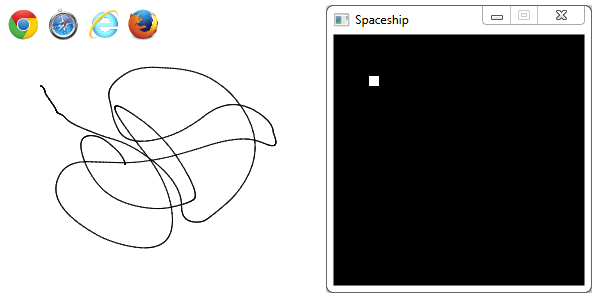

Visualize and control C++ data using the web browser. Single hpp/cpp, no dependencies, OS X, Windows, Linux.



What is it for?
---------------

Use a web browser to easily visualize data from your C++ program and control it’s behaviour. 

Who is it for?
--------------

+ You have a console application and want to visualize some data it’s producing at runtime. 
+ You have a game and don’t want to write an ingame gui to control it’s behaviour. 
+ You found a bug and need to graph the value of a variable to get a better understanding of the faulty behaviour.

What does it do?
----------------

LibGateY helps you send data structures over WebSockets from your C++ program to the web browser and the other way. It can send and receive a large amount of C++ standard types by default. For example `std::map<std::string, std::tuple<float, float, float>>` will automatically be converted to a JSON object of the form `{ key0: [x, y, z], key1: [x, y, z] }` The serialization machinery can be extended to support your own types.

How do I use it?
----------------

LibGateY tries to be as simple to deploy as possible, so it consists of only one .hpp and one .cpp file. It doesn’t have any dependecies. Just copy it into your project.

Spaceship example
-----------------

##### C++
```c++
gatey::global = std::make_shared<gatey::GateY>();

SDL_Init(SDL_INIT_EVERYTHING);
SDL_Window *win = SDL_CreateWindow("Spaceship", 50, 50, 250, 250, SDL_WINDOW_SHOWN);
SDL_Renderer *renderer = SDL_CreateRenderer(win, -1, SDL_RENDERER_ACCELERATED);

Vec2 position(125, 125), velocity(0, 0);
gatey::WriteVariable<Vec2> gPosition("position"), gVelocity("velocity");
gatey::ReadVariable<float> gPower("power", 20.0f);


float dt = 1.0f / 30;

std::vector<SDL_Rect> trail;

while (true){
    double tStart = time();
    
    SDL_Event e;
    while (SDL_PollEvent(&e)) {
        if (e.type == SDL_QUIT)
            return 0;
    }
    
    Vec2 acceleration(0, 0);
    Uint8 const* keyboard = SDL_GetKeyboardState(nullptr);
    if(keyboard[SDL_SCANCODE_LEFT]) acceleration += Vec2(-1, 0);
    if(keyboard[SDL_SCANCODE_RIGHT]) acceleration += Vec2(1, 0);
    if(keyboard[SDL_SCANCODE_UP]) acceleration += Vec2(0, -1);
    if(keyboard[SDL_SCANCODE_DOWN]) acceleration += Vec2(0, 1);
    
    velocity += dt * gPower.get() * acceleration;
    position += dt * velocity;
    
    gVelocity.set(velocity);
    gPosition.set(position);
    
    SDL_SetRenderDrawColor(renderer, 0, 0, 0, 255); //black
    SDL_RenderClear(renderer);
    
    SDL_Rect rect = { (int)position.x - 5, (int)position.y - 5, 10, 10 };
    SDL_SetRenderDrawColor(renderer, 255, 255, 255, 255); //white
    SDL_RenderFillRect(renderer, &rect);
    
    SDL_RenderPresent(renderer);
    
    double tEnd = time();
    int tDeltaInMs = (int)(1000.0 * (tEnd - tStart));
    SDL_Delay(std::max(30 - tDeltaInMs, 0));
}
```

##### Javascript
```javascript
var gPosition = new gatey.ReadVariable('position', 0);
var gVelocity = new gatey.ReadVariable('velocity', 0);
var gPower = new gatey.WriteVariable('power');

//Create a slider to control spaceship acceleration
function slideUpdate() {
    gPower.set($("#slider_a").slider("value"));
}

$(function() {
    $('#slider_a').slider({
        min: 0, max: 100, value: 20,
        slide: slideUpdate, change: slideUpdate
    });
});

//Draw the spaceship trajectory
var canvas = document.getElementById('spaceship_trace');
var ctx = canvas.getContext('2d');

var lastPos = undefined;
gPosition.onChange = function(newPos) {
    if(lastPos) {
        ctx.beginPath();
        ctx.moveTo(lastPos[0], lastPos[1]);
        ctx.lineTo(newPos[0], newPos[1]);
        ctx.stroke();

        $('#position').html(JSON.stringify(newPos));
    }

    lastPos = newPos;
};
```
